# Mảng ảo trong KVM
---
## Tổng quan
Thành phần chính trong libvirt networking là virtual network switch, còn được gọi là bridge. Về cơ bản Bridge tương tự như physical switch.

Với switch thật, có nhưng giới hạn (limited) vế số physical port có thế sử dụng để kết nối tới Host. Tại Linux bridge sẽ không có những giới hạn về số port ảo (virtual ports) sử dụng cho kết nối tới VMs.

> Similar to a physical switch, bridge learns the MAC addresses from the packets it receives and stores those MAC addresses in the MAC table. The packet (frames) forwarding decisions are taken based on the MAC addresses that it learned and stored in the MAC table

Có như interface đặc biệt trong bridge. Những interfaces thuộc special network devices được gọi là TAP device.

TAP devices tương tự network cable chuyển Ethernet frames giữa virtual machine với bridge. TAP device là 1 phần của TUN/ TAP implementation available within the Linux kernel.

> TUN, which stands for "tunnel", simulates a network layer device and it operates at OSI reference model's layer 3 packets, such as IP packets. TAP (namely a network tap) simulates a link layer device and it operates at OSI reference model's layer 2 packets, such as Ethernet frames. TUN is used with routing, while TAP is used to create a network bridge.

Kiểm tra bridge chạy trên CentOS
```
lsmod | grep bridge

bridge                107106  1 ebtable_broute
stp                    12976  1 bridge
llc                    14552  2 stp,bridge
```

## Virtual networking sử dụng libvirt
### Các tùy chọn virtual networking có sẵn trong libvirt:
- Isolated virtual network
- Routed virtual network
- NATed virtual network
- Bridged network using a physical NIC, VLAN interface, bond interface,
and bonded VLAN interface
- MacVTap (đọc thêm)
- PCI passthrough NPIV (đọc thêm)
- OVS (đọc thêm)

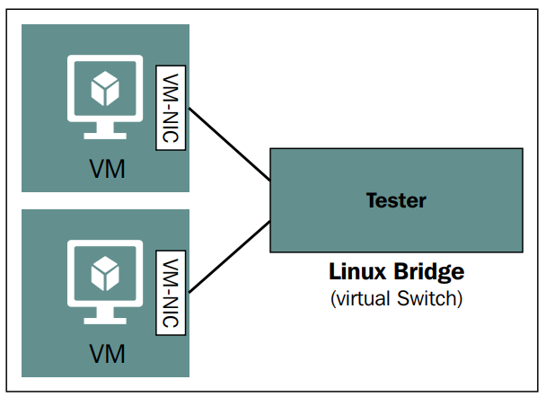

### Isolated virtual network
Tạo mạng riêng cho VM, chỉ có các VM được thêm card mới có thể kết nối với nhau

__Kiến trúc__

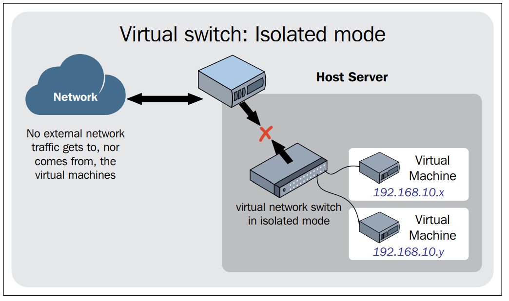

#### Phương pháp tạo isolated virtual network
__Bước 1: Chọn Connection Detail__

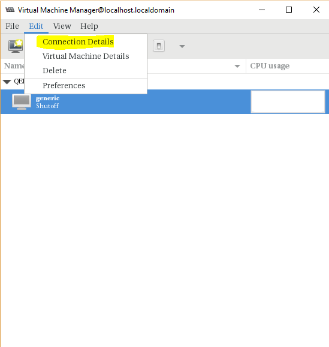

__Bước 2: Chọn `+`__

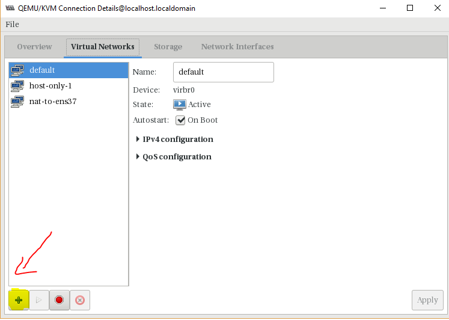

__Bước 3: Nhập Net ID, cấp phất DHCP__

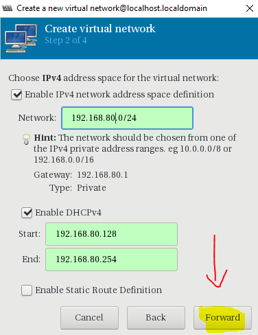

__Bước 4:__

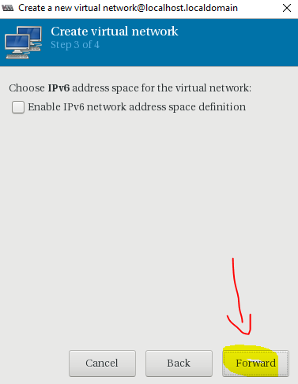

__Bước 5: Chọn Isolated virtual network__

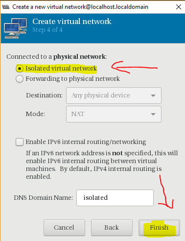

__Bước 6: Kết quả__

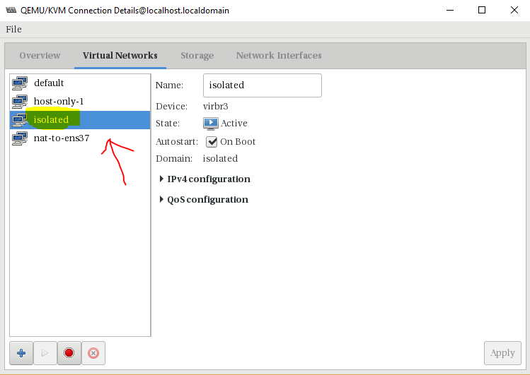

__Kiểm tra các network hiện có__

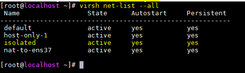

__Xem thông tin network vừa tạo:__

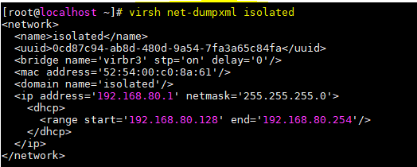

__Chi tiết các thông số cung cấp__
- `<uuid>`: A unique ID of your bridge.
- `<bridge>`: Used for defining the bridge details. Here, the name of the bridge is virbr1, with STP ON and DELAY 0. These are the same parameters you
can control using the brctl command. STP is set by stp and DELAY by
setfd. Go back and check the brctl command options.
- `<mac>`: The MAC address of the bridge to be assigned at the time of
the creation.

__Truy cập isolated virtual network thông qua virsh__
```
virsh net-start isolated
```

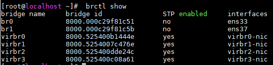


### Routed virtual network
Virtual network kết nối tới physical network thông qua phương pháp IP routes để kết nối tới hypervisor.
Phương pháp định tuyến traffic từ virtual machines tới network attached trong hypervisor và ngược lại.

Vấn đề cân lưu ý là setup IP chính xác cho việc định tuyến tới router hoặc gateway device

> This mode is not commonly used, unless you have a special use case to create a network with this complexity.

__Kiến trúc__

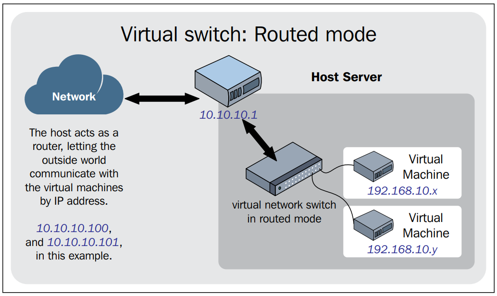

#### Cấu hình isolated virtual network
__Bước 1:__

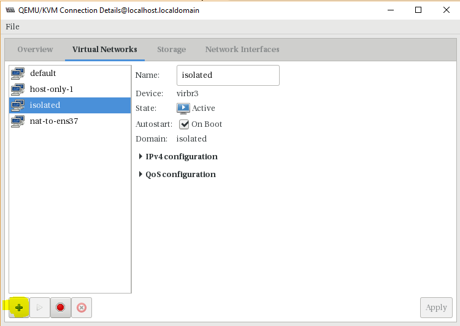

__Bước 2:__

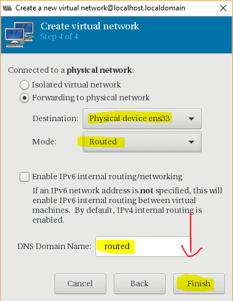

__Bước 3:__

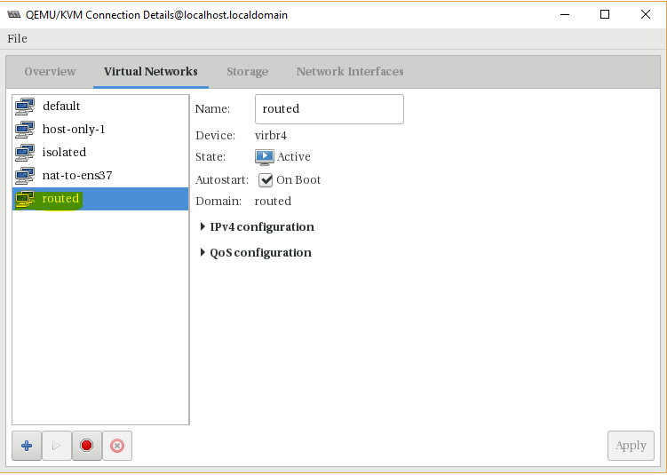

Network routed defined from routed.xml:
```
virsh net-start routed
```
Network routed started
```
virsh auto-start routed
```
Network route marked as auto start:
```
virsh net-info routed
```

### Chỉnh sửa virtual network
Trước khi thay đổi cấu hình virtual network, cần dựng virtual network đang chạy
```
virsh net-destroy routed
```
Thay đổi cấu hình sử dụng net-edit:
```
virsh net-edit routed
```

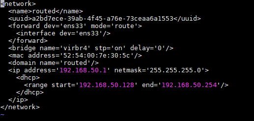

Sau khi xác thực cấu hình, chạy mạng ảo bằng net-start
```
virsh net-start routed
```

### NATed virtual network
Mạng ảo sử dụng nhiều nhất khi yêu cầu lab, test môi trượng trên Laptop hoặc PC cá nhân. Nó cho phép VM kết nối tới mạng ngoài đơn giản, không yêu cầu cấu hình thêm.

Phương pháp cũng cho phép Host tương tác được với VMs. Hạn chế lớn nhất là các Host cùng dải mạng với Host base VM không thể kết nối tới VMs được.

NAT virtual network được tạo với iptables, cùng các rule nhất định. Vì vậy, cần lưu ý khi cấu hình Iptables đối với các VMs Nat, chúng có thể ảnh hưởng tới Host thật.

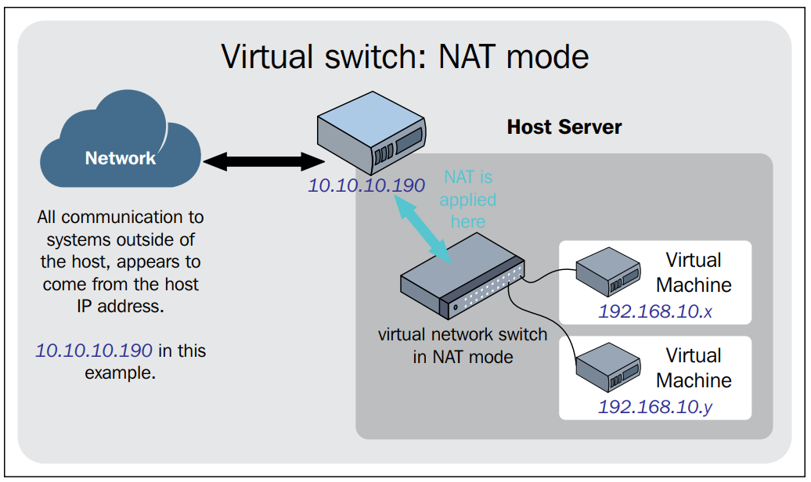

#### Cấu hình NATed virtual network
__Cách tạo tương với với isolated network, cần lưu ý__

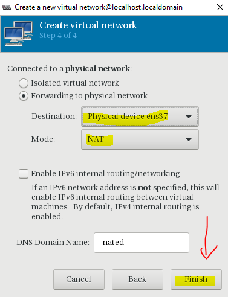

### Brigde network

Bridged network sử dụng để chia sẻ mạng của thiết bị thật tới các Vm (VMs). Mỗi VM được cung cấp địa chỉ có sẵn của router tại dải mạng thực cung cấp cho host. Bridged networking cho phép VMs kết nối với mạng bên ngoài thông qua card mạng vật lý máy chủ.

__Kiến trúc__


__Các bước cơ bản để tạo bridge:__

1. Cấu hình card mạng chia sẻ không có ip (ens33)
2. Tạo mới interface bridge (br0)
3. Có thể gán ip tĩnh cho card bridge nhưng không được gán cho card mạng vật lý gán tới bridge (Tùy chọn)
