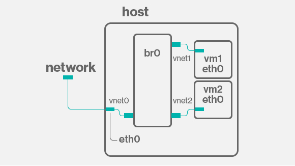
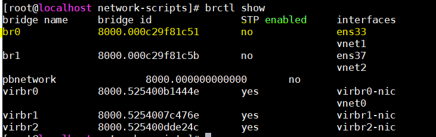
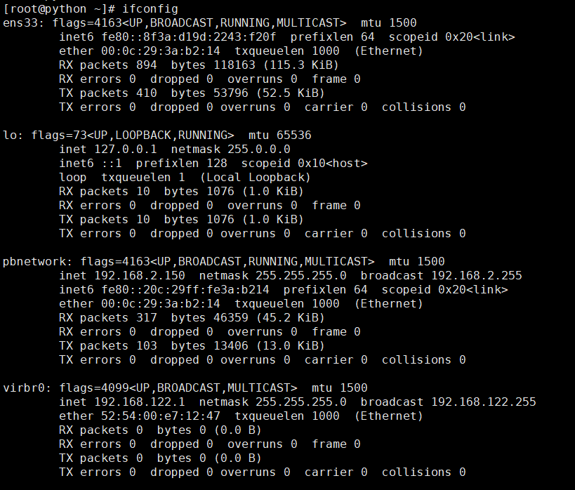

# Network brigde trong KVM
## Tổng quan
Brigde là cách kết nôi 2 Ethernet segmet với nhau thông qua giao thức độc lập. Các Packet được chuyển tieeso dựa trên Ethenet address, khác với IP address (như router). Phương thức xảy ra tại layer 2, tất cả protocol có thể chạy rõ ràng trên brigde.

Linux brigde code thực thi theo tiêu chuẩn ANSI/IEEE 802.1d. Phiên bản chính thức đầu tiên công bố tại Linux 2.2, tích hợp với kerner từ phiên bản 2.4.

Công việc của Brigde là quyết định đích đến gói tin có hay không cần truyền qua Ethernet, tiết kiệm chí phí, băng thông

Bridged network sử dụng để chia sẻ mạng của thiết bị thật tới các Vm (VMs). Mỗi VM được cung cấp địa chỉ có sẵn của router tại dải mạng thực cung cấp cho host. Bridged networking cho phép VMs kết nối với mạng bên ngoài thông qua card mạng vật lý máy chủ.

## Kiến trúc


## Các bước cơ bản để tạo bridge:
1. Cấu hình card mạng chia sẻ không có ip (ens33)
2. Tạo mới interface bridge (br0)
3. Có thể gán ip tĩnh cho card bridge nhưng không được gán cho card mạng vật lý gán tới bridge (Tùy chọn)

## Cấu hình
### Tùy chọn 1: Cấu hình thủ công
#### Bước 1: Cấu hình card mạng thật tại KVM node
```
cd /etc/sysconfig/network-scripts
vi ifcfg-ens33
```
Nội dung
```
DEVICE=ens33
TYPE=Ethernet
ONBOOT=yes
BRIDGE=br0
BOOTPROTO=static
```
#### Bước 2: Cấu hình card mạng brigde
```
cd /etc/sysconfig/network-scripts
vi ifcfg-br0
```
Nội dung
```
TYPE=Bridge
BOOTPROTO=none
IPADDR=192.168.2.133
GATEWAY=192.168.2.2
NETMASK=255.255.255.0
DNS1=192.168.2.2

NAME="br0"
DEVICE="br0"
ONBOOT="yes"
BRIGDE=br0

```
#### Bước 3: Khởi động lại card mạng
```
service network restart
```

#### Kiểm tra card bridge đã có
```
brctl show
```


### Tùy chọn 2: Cấu hình thông qua `brctl`
#### Bước 1: Tạo bridge interface
```
brctl addbr pbnetwork
```
#### Bước 2: Gán interfaces tới bridge
```
brctl addif pbnetwork ens33
```
#### Bước 3: Gán Zero IP tới interface gán bridge
```
ifconfig ens33 0.0.0.0
```
#### Bước 4: Up bridge interface
```
ifconfig pbnetwork up
```
#### Bước 5: Cấu hình IP tĩnh cho bridge (Tùy chọn)
```
ifconfig pbnetwork 192.168.2.150 netmask 255.255.255.0 up
```
#### Kết quả

