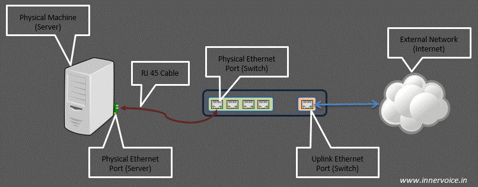

# Network brigde trong KVM
---
__Mục lục__
[Phần 1: Tổng quan](#phan1)

[Phần 2: Kiến trúc](#phan2)

[Phần 3: Cấu trúc và các thành phần](#phan3)

[Phần 4: Các khái niệm quan trọng](#phan4)

[Phần 5: Cấu hình](#phan5)

<a name="phan1"></a>
## 1. Tổng quan
Brigde là cách kết nôi 2 Ethernet segmet với nhau thông qua giao thức độc lập. Các Packet được chuyển tieeso dựa trên Ethenet address, khác với IP address (như router). Phương thức xảy ra tại layer 2, tất cả protocol có thể chạy rõ ràng trên brigde.

Linux brigde code thực thi theo tiêu chuẩn ANSI/IEEE 802.1d. Phiên bản chính thức đầu tiên công bố tại Linux 2.2, tích hợp với kerner từ phiên bản 2.4.

Công việc của Brigde là quyết định đích đến gói tin có hay không cần truyền qua Ethernet, tiết kiệm chí phí, băng thông

Bridged network sử dụng để chia sẻ mạng của thiết bị thật tới các Vm (VMs). Mỗi VM được cung cấp địa chỉ có sẵn của router tại dải mạng thực cung cấp cho host. Bridged networking cho phép VMs kết nối với mạng bên ngoài thông qua card mạng vật lý máy chủ.

<a name="phan2"></a>
## 2. Kiến trúc
### 2.1 Kiến trúc tổng quan


### 2.2 Kiến trúc hệ thống


<a name="phan3"></a>
## 3. Cấu trúc và các thành phần
### 3.1 Cấu trúc Linux Bridge


Các khái niệm liên quan tới linux bridge:
-	`Port`: tương đương với port của switch thật
-	`Bridge`: tương đương với switch layer 2
-	`Tap`: hay tap interface có thể hiểu là giao diện mạng để các VM kết nối với bridge cho linux bridge tạo ra (nó nằm trong nhân kernel, hoạt động ở lớp 2 của mô hình OSI)
-	`fd`: forward data - chuyển tiếp dữ liệu từ máy ảo tới bridge.

### 3.2 Các tính năng
- `STP`: Spanning Tree Protocol - giao thức chống loop gói tin trong mạng.
-	`VLAN`: chia switch (do linux bridge tạo ra) thành các mạng LAN ảo, cô lập traffic giữa các VM trên các VLAN khác nhau của cùng một switch.
-	`FDB`: chuyển tiếp các gói tin theo database để nâng cao hiệu năng switch.

<a name="phan4"></a>
## 4 Các khái niệm quan trọng
### 4.1 Các khái niệm cần lưu ý
- `Virtual Computing Device`: Thường được biết đến như là máy ảo VM chạy trong host server
- `Virtual NIC (vNIC)`: máy ảo VM có virtual network adapters(vNIC) mà đóng vai trò là NIC cho máy ảo.
- `Physical swtich port`: Là port sử dụng cho Ethernet switch, cổng vật lý xác định bởi các port RJ45. Một port RJ45 kết nối tới port trên NIC của máy host.
- `Virtual switch port`: là port ảo tồn tại trên virtual switch. Cả virtual NIC (vNIC) và virtual port đều là phần mềm, nó liên kết với virtual cable kết nối vNIC

### 4.2 Uplink port
Uplink port là khái niệm chỉ điểm vào ra của lưu lượng trong một switch ra các mạng bên ngoài. Nó sẽ là nơi tập trung tất cả các lưu lượng trên switch nếu muốn ra mạng ngoài.



> Khái niệm virtual uplink switch port được hiểu có chức năng tương đương, là điểm để các lưu lượng trên các máy guest ảo đi ra ngoài máy host thật, hoặc ra mạng ngoài. Khi thêm một interface trên máy thật vào bridge (tạo mạng bridging với interface máy thật và đi ra ngoài), thì interface trên máy thật chính là virtual uplink port.

### 4.3 Tap interface
Ethernet port trên máy ảo VM (mô phỏng pNIC) thường gọi là vNIC (Virtual NIC). Virtual port được mô phỏng với sự hỗ trợ của KVM/QEMU.

Port trên máy ảo VM chỉ có thể xử lý các frame Ethernet. Trong môi trường thực tế (không ảo hóa) interface NIC vật lý sẽ nhận và xử lý các khung Ethernet. Nó sẽ bóc lớp header và chuyển tiếp payload (thường là gói tin IP) tới lên cho hệ điều hành. Tuy nhiên, với môi trường ảo hóa, nó sẽ không làm việc vì các virtual NIC sẽ mong đợi các khung Ethernet.

Tap interface là một khái niệm về phần mềm được sử dụng để nói với Linux bridge là chuyến tiếp frame Ethernet vào nó. Hay nói cách khác, máy ảo kết nối tới tap interface sẽ có thể nhận được các khung frame Ethernet thô. Và do đó, máy ảo VM có thể tiếp tục được mô phỏng như là một máy vật lý ở trong mạng.

Nói chung, tap interface là một port trên switch dùng để kết nối với các máy ảo VM.


<a name="phan5"></a>
## 5. Cấu hình
### Các bước cơ bản để tạo bridge:
1. Cấu hình card mạng chia sẻ không có ip (ens33)
2. Tạo mới interface bridge (br0)
3. Có thể gán ip tĩnh cho card bridge nhưng không được gán cho card mạng vật lý gán tới bridge (Tùy chọn)

### Tùy chọn 1: Cấu hình thủ công
#### Bước 1: Cấu hình card mạng thật tại KVM node
```
cd /etc/sysconfig/network-scripts
vi ifcfg-ens33
```
Nội dung
```
DEVICE=ens33
TYPE=Ethernet
ONBOOT=yes
BRIDGE=br0
BOOTPROTO=static
```
#### Bước 2: Cấu hình card mạng brigde
```
cd /etc/sysconfig/network-scripts
vi ifcfg-br0
```
Nội dung
```
TYPE=Bridge
BOOTPROTO=none
IPADDR=192.168.2.133
GATEWAY=192.168.2.2
NETMASK=255.255.255.0
DNS1=192.168.2.2

NAME="br0"
DEVICE="br0"
ONBOOT="yes"
BRIGDE=br0

```
#### Bước 3: Khởi động lại card mạng
```
service network restart
```

#### Kiểm tra card bridge đã có
```
brctl show
```


### Tùy chọn 2: Cấu hình thông qua `brctl`
> Cấu hình sẽ mất sau khi reboot
#### Bước 1: Tạo bridge interface
```
brctl addbr pbnetwork
```
#### Bước 2: Gán interfaces tới bridge
```
brctl addif pbnetwork ens33
```
#### Bước 3: Gán Zero IP tới interface gán bridge
```
ifconfig ens33 0.0.0.0
```
#### Bước 4: Up bridge interface
```
ifconfig pbnetwork up
```
#### Bước 5: Cấu hình IP tĩnh cho bridge (Tùy chọn)
```
ifconfig pbnetwork 192.168.2.150 netmask 255.255.255.0 up
```
#### Kết quả


### Tùy chọn 3: Cấu hình thông qua Virt-Manager
#### Bước 1: Khởi động virt-manager
```
virt-manager
```
#### Bước 2: Chọn Edit > Connection Details > Network interface > Chọn `+`

#### Bước 3: Chọn interface type = bridge > Forward

#### Bước 4: Nhập tên, chọn interface bridge > Finish


#### Bước 5: Kết nối bridge với interface thực
```
brctl addif br2 ens38
```
> Các thay đổi bằng `brctl` sẽ mất sau khi reboot

#### Kết quả


### Lưu ý:
> bridge tạo bởi cmd brctl không nhận trong kvm, reboot mất cấu hình, đã kiểm tra, đã thử + restart service libvirtd đều không nhận

> bridge tạo bởi virt-manage tồn tại vĩnh viễn do tạo file config, cần restart network để apply cấu hình mới

## Nguồn
https://github.com/hocchudong/thuctap012017/blob/master/TamNT/Virtualization/docs/Virtual_Switch/1.Linux-Bridge.md#6
https://github.com/thaihust/Thuc-tap-thang-03-2016/blob/master/ThaiPH/VirtualSwitch/Linux-bridge/ThaiPH_tim_hieu_linux_bridge.md
http://www.innervoice.in/blogs/2013/12/02/linux-bridge-virtual-networking/
