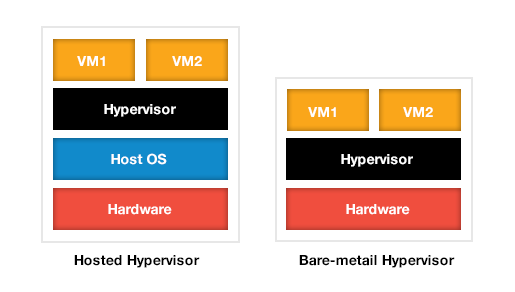
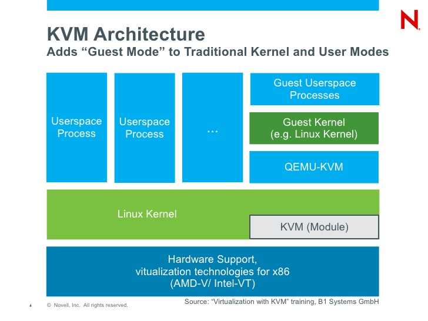

# Tổng quan về KVM
---
## Giới thiệu
Ảo hóa được hiểu một cách đơn giản là chạy nhiều máy chủ ảo trên hạ tầng 01 máy chủ vật lý. Trên mỗi máy ảo có hệ điều hành riêng giống như 01 máy chủ thật và được triển khai các môi trường, ứng dụng khác nhau để phù hợp với hoạt động và mục đích của doanh nghiệp.

__2 lợi ích chính khi sử dụng ảo hóa:__
- Giảm chi phí về hạ tầng IT và quản trị hệ thống: ảo hóa giúp tạo nhiều máy chủ ảo, khai thác triệt để tài nguyên vật lý của máy chủ, từ đó giúp giảm chi phí đầu tư của doanh nghiệp, đồng thời giúp thiết lập hệ thống nhanh hơn, thuận tiện cho quản trị và giám sát, giảm chi phí nhân công vận hành.
- Tăng hiệu suất và tính linh hoạt của hệ thống: việc quản trị và khai thác triệt để tài nguyên vật lý giúp nâng cao hiệu suất của từng máy chủ vật lý và của toàn hệ thống, đồng thời linh hoạt trong vấn đề mở rộng máy ảo, sao lưu, dự phòng, di chuyển máy ảo.

## Các tính năng chính
__Partitioning – Phân chia máy chủ vật lý__
- Chạy nhiều máy ảo trên 01 máy chủ vật lý
- Có cơ chế phân chia và phân phối tài nguyên tương ứng, chính xác cho các máy ảo được khai báo và khởi tạo.

__Isolation – Cách ly máy ảo__
- Cách ly các máy ảo với nhau. Đây là tính năng rất hiệu quả khi xảy ra các sự cố, đặc biệt về ANTT, việc lây nhiễm từ 01 máy ảo sẽ hạn chế bị ảnh hưởng đến các máy ảo khác cũng như các hệ thống khác.
- Kiểm soát và tối ưu tài nguyên hợp lý giữa các máy ảo, tránh các hiện tượng không kiểm soát tài nguyên và gây quá tải hoặc dư thừa tài nguyên trên các máy ảo.

__Encapsulation – Đóng gói máy ảo__
- Đóng gói các máy ảo thành các file riêng biệt.
- Dễ dàng sao chép và di chuyển các máy ảo sang các hệ thống khác, hoặc phục vụ sao lưu, dự phòng.

__Hardware Independence – Không phụ thuộc thiết bị phần cứng__
- Ảo hóa được thiết kế phù hợp với tất cả các phần cứng có hỗ trợ công nghệ ảo hóa.

## 2 Loại ảo hóa chính
### Bare-Metal Hypervisor
Hypervisor tương tác trực tiếp với phần cứng của máy chủ để quản lý, phân phối và cấp phát tài nguyên (hình …). Loại ảo hóa này bao gồm các giải pháp như Vmware ESXi, Microsoft Hyper-V, Xen Server, KVM.

Hypervisor tương tác trực tiếp với phần cứng nên việc quản lý và phân phối tài nguyên được tối ưu. Sử dụng trong môi trường thực tế (Production)

### Host-based hypervisor
Hypervisor giao tiếp với phần cứng thông qua hệ điều hành. Hypervisor lúc này được xem như một ứng dụng của hệ điều hành và các phương thức quản lý, cấp phát tài nguyên đều phải thông qua hệ điều hành. Loại ảo hóa này bao gồm các giải pháp như Vmware WorkStation, Oracle VirtualBox, Microsoft Virtual PC, …

Có hiệu năng thấp hơn vì tương tác thông qua OS, chỉ sử dụng trong các trường hợp thử nghiệm, hoặc mục đích học tập.

> KVM thuộc loại ảo hóa thứ 01 (Bare-Metal hypervisor), là một trong các lựa chọn phổ biến hiện nay trong việc triển khai các giải pháp ảo hóa cho hệ thống.

## Ảo hóa KVM – Kernel-Based Virtual Machine
### Tổng quan 
VM ra đời phiên bản đầu tiên vào năm 2007 bởi công ty Qumranet tại Isarel, KVM được tích hợp sẵn vào nhân của hệ điều hành Linux bắt đầu từ phiên bản 2.6.20. Năm 2008, RedHat đã mua lại Qumranet và bắt đầu phát triển, phổ biến KVM Hypervisor.

### Kiến trúc

### Một số đặc điểm của KVM:
- Là giải pháp ảo hóa dạng toàn phần và hoàn toàn nguồn mở, miễn phí.
- Hỗ trợ các loại công nghệ phần cứng đa dạng và thông dụng như Intel-VT, AMD-V.
- Cung cấp các máy ảo đa dạng, hỗ trợ nhiều loại hệ điều hành và không cần tinh chỉnh lại các ảnh của hệ điều hành
- Sử dụng cơ chế quản lý vùng nhớ của Linux (KSM) và các cơ chế bảo mật có sẵn của Linux (SELinux)

> Với ưu điểm nguồn mở và độ tùy biến cao, KVM hypervisor được lựa chọn là nền tảng ảo hóa chính khi lựa chọn công nghệ ảo hóa nguồn mở. KVM cũng đồng thời là nền tảng của giải pháp điện toán đám mây nguồn mở nổi tiếng nhất hiện nay là OpenStack.

