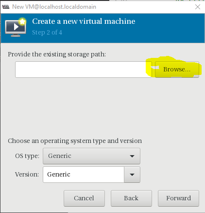
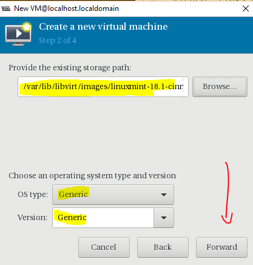
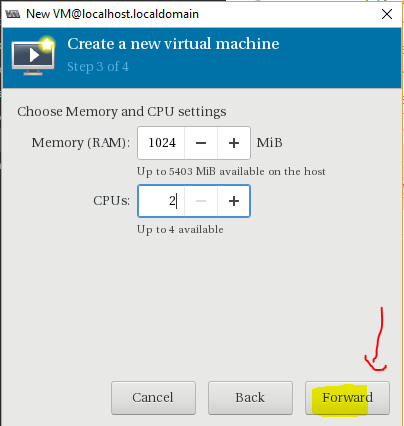
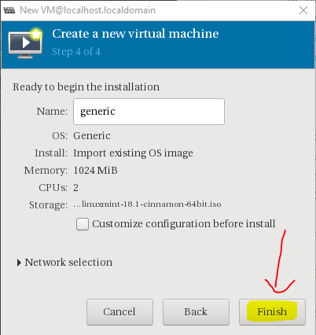
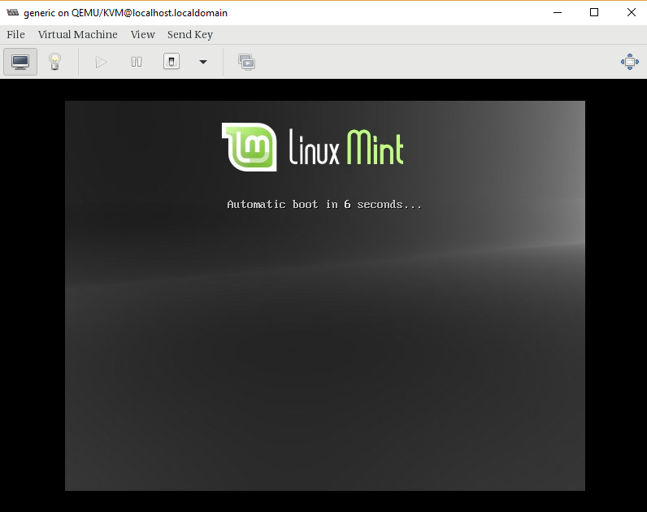

# Cài đặt KVM Hypervisor, tạo VM trên CentOS 7
---
## Tổng quan KVM
(xem thêm docs)
## Chuẩn bị
Cài đặt trên 1 node CentOS 7

Tài nguyên
```
CPU 4 Core
RAM 4 GB
HDD 50GB
```
## Cài đặt
### Chuẩn bị
Trước khi cài kiểm tra CPU có hỗ trợ ảo hóa
```
grep -E '(vmx|svm)' /proc/cpuinfo
```
> Nếu hiện ra 1 vài dòng vmx hoặc svm tại đầu ra thì CPU hỗ trợ và ngược lại

### Phần 1: Cài đặt KVM và các package hỗ trợ
#### Bước 1: Cài đặt gói và các hỗ trợ
```
yum install qemu-kvm qemu-img virt-manager libvirt libvirt-python libvirt-client virt-install virt-viewer bridge-utils -y
```
#### Bước 2: Khởi động dịch vụ libvirtd service
```
systemctl start libvirtd
systemctl enable libvirtd
```
#### Kiểm tra service KVM
```
lsmod | grep kvm

# KQ
kvm_intel             162153  0
kvm                   525409  1 kvm_intel
```
#### Bước 3: Nếu chạy CentOS 7/RHEL 7 minimal
Nếu chạy server với phiên bản trên, thiết lập x-window để có thể truy cập từ xa

```
yum install "@X Window System" xorg-x11-xauth xorg-x11-fonts-* xorg-x11-utils -y
```

### Phần 2: Thiết lập Virt Manager
#### Bước 1: Khởi động Virt Manager
```
virt-manager
```
__Giao diện__


### Phần 3: Cấu hình Bridge KVM
#### Bước 1: Cấu hình card mạng KVM node
```
cd /etc/sysconfig/network-scripts
vi ifcfg-ens33
```
Nội dung
```
DEVICE=ens33
TYPE=Ethernet
ONBOOT=yes
BRIDGE=br0
BOOTPROTO=static
```
#### Bước 2: Cấu hình card mạng brigde
```
cd /etc/sysconfig/network-scripts
vi ifcfg-br0
```
Nội dung
```
TYPE=Bridge
BOOTPROTO=none
IPADDR=192.168.2.133
GATEWAY=192.168.2.2
NETMASK=255.255.255.0
DNS1=192.168.2.2

NAME="br0"
DEVICE="br0"
ONBOOT="yes"
BRIGDE=br0

```
#### Bước 3: Khởi động lại card mạng
```
service network restart
```
__KẾT QUẢ__
```
br0: flags=4163<UP,BROADCAST,RUNNING,MULTICAST>  mtu 1500
        inet 192.168.2.133  netmask 255.255.255.0  broadcast 192.168.2.255
        inet6 fe80::20c:29ff:fef8:1c51  prefixlen 64  scopeid 0x20<link>
        ether 00:0c:29:f8:1c:51  txqueuelen 1000  (Ethernet)
        RX packets 31055  bytes 1860666 (1.7 MiB)
        RX errors 0  dropped 0  overruns 0  frame 0
        TX packets 62635  bytes 47007858 (44.8 MiB)
        TX errors 0  dropped 0 overruns 0  carrier 0  collisions 0

ens33: flags=4163<UP,BROADCAST,RUNNING,MULTICAST>  mtu 1500
        ether 00:0c:29:f8:1c:51  txqueuelen 1000  (Ethernet)
        RX packets 3055441  bytes 2249618953 (2.0 GiB)
        RX errors 0  dropped 2  overruns 0  frame 0
        TX packets 5143968  bytes 3178592295 (2.9 GiB)
        TX errors 0  dropped 0 overruns 0  carrier 0  collisions 0

lo: flags=73<UP,LOOPBACK,RUNNING>  mtu 65536
        inet 127.0.0.1  netmask 255.0.0.0
        inet6 ::1  prefixlen 128  scopeid 0x10<host>
        loop  txqueuelen 1  (Local Loopback)
        RX packets 2850763  bytes 142759250632 (132.9 GiB)
        RX errors 0  dropped 0  overruns 0  frame 0
        TX packets 2850763  bytes 142759250632 (132.9 GiB)
        TX errors 0  dropped 0 overruns 0  carrier 0  collisions 0

virbr0: flags=4099<UP,BROADCAST,MULTICAST>  mtu 1500
        inet 192.168.122.1  netmask 255.255.255.0  broadcast 192.168.122.255
        ether 52:54:00:b1:44:4e  txqueuelen 1000  (Ethernet)
        RX packets 1921  bytes 155378 (151.7 KiB)
        RX errors 0  dropped 0  overruns 0  frame 0
        TX packets 2113  bytes 1746118 (1.6 MiB)
        TX errors 0  dropped 0 overruns 0  carrier 0  collisions 0
```

## Phần 4: Up images các OS dùng trong KVM
### Bước 1: Up image OS về mấy cá nhân hoặc KVM node
> Sử dụng ftp up lên KVM node trong trường hợp bản cài OS đã có trong máy
### Bước 2: Chuyển images tới thư mục
```
mv image_os.iso /var/lib/libvirt/images/
```
### Bước 3: Thiết lập quyền truy cập image
```
chmod 777 /var/lib/libvirt/images/image_os
```

## Phần 5: Tạo máy ảo thông qua virt-manager
> Import image có sẵn
### Bước 1: Chọn tạo mới VM

### Bước 2: Cài từ images có sẵn

### Bước 3: Chọn đĩa cài

### Bước 4: Xác nhận loại đĩa

### Bước 5: Cấu hình máy ảo

### Bước 6: Chọn thiết lập boot

### Bước 7: Kết quả



## Nguồn
https://www.linuxtechi.com/install-kvm-hypervisor-on-centos-7-and-rhel-7/
