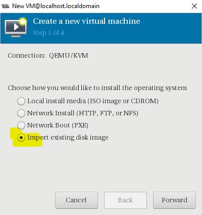
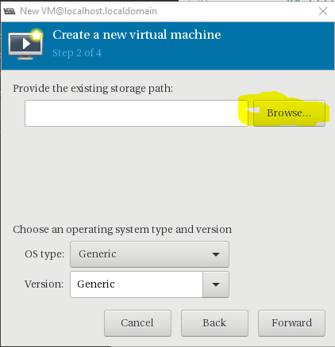
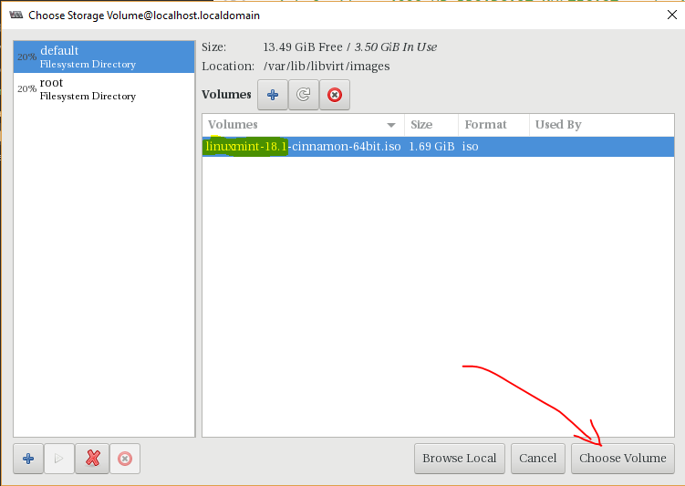
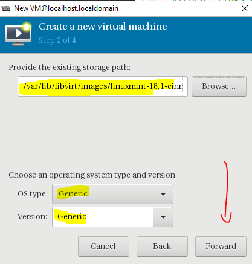
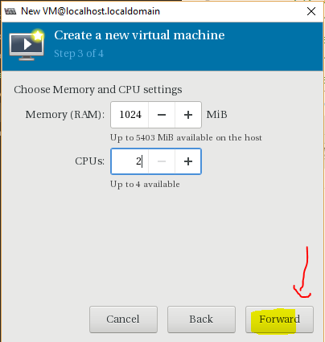
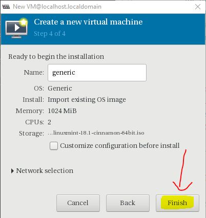
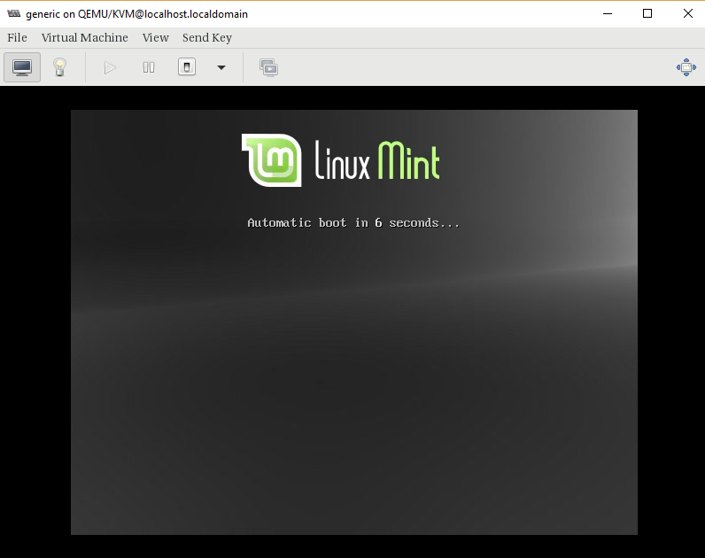
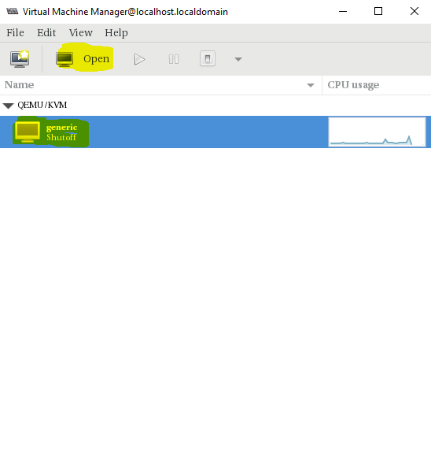
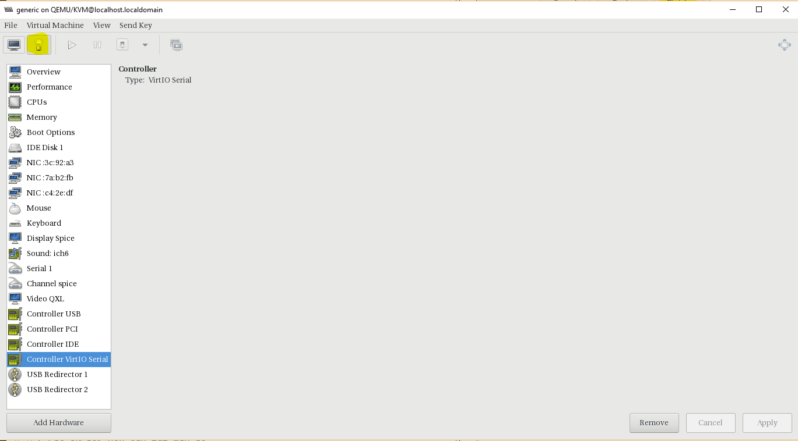
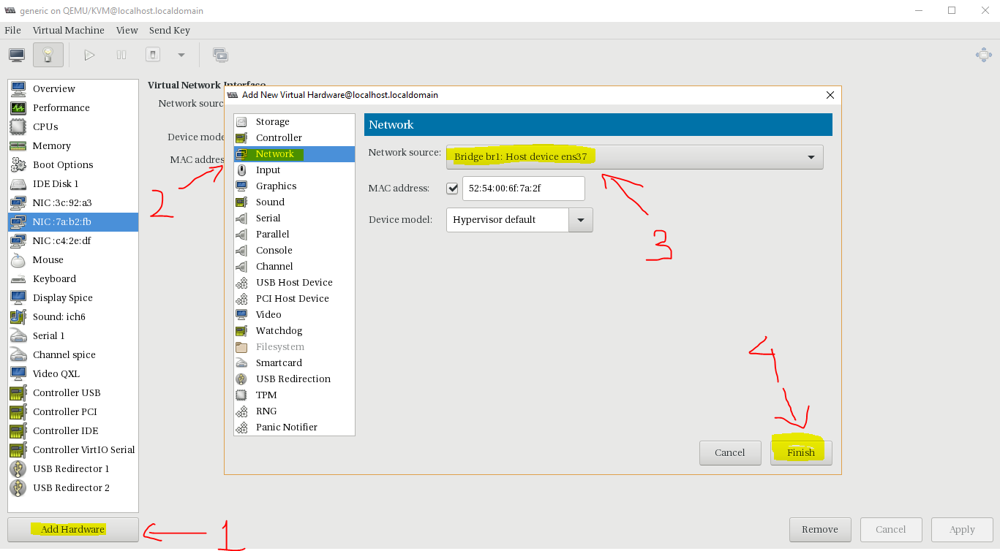

# Thiết lập máy ảo thông qua virt-manager
---
## Cấu hình
### Phần 1: Up images các OS dùng trong KVM
#### Bước 1: Up image OS về mấy cá nhân hoặc KVM node
> Sử dụng ftp up lên KVM node trong trường hợp bản cài OS đã có trong máy
#### Bước 2: Chuyển images tới thư mục
```
mv image_os.iso /var/lib/libvirt/images/
```
#### Bước 3: Thiết lập quyền truy cập image
```
chmod 777 /var/lib/libvirt/images/image_os
```
### Phần 2: Tạo mới máy ảo
#### Bước 1: Khởi động virt-manager
```
virt-manager
```
#### Bước 2: Chọn tạo mới VM

#### Bước 3: Cài từ images có sẵn

#### Bước 4: Chọn đĩa cài

#### Bước 5: Xác nhận loại đĩa

#### Bước 6: Cấu hình máy ảo

#### Bước 7: Chọn thiết lập boot

#### Bước 8: Kết quả


### Phần 3: Thiết lập thông số cho VM
> Các sửa đổi yêu cầu tắt máy ảo

#### Bước 1: Chọn VM cần sử đổi > Chọn Open

#### Bước 2: Chọn Show detail


> Tại đây ta có thể thêm sửa xóa các thành phần trong VM như CPU, RAM, HDD, NETWOK

#### Thêm card mạng mới
1. Chọn Add Hardware
2. Chọn Network
3. Chọn Network source cần
4. Chọn Finish


